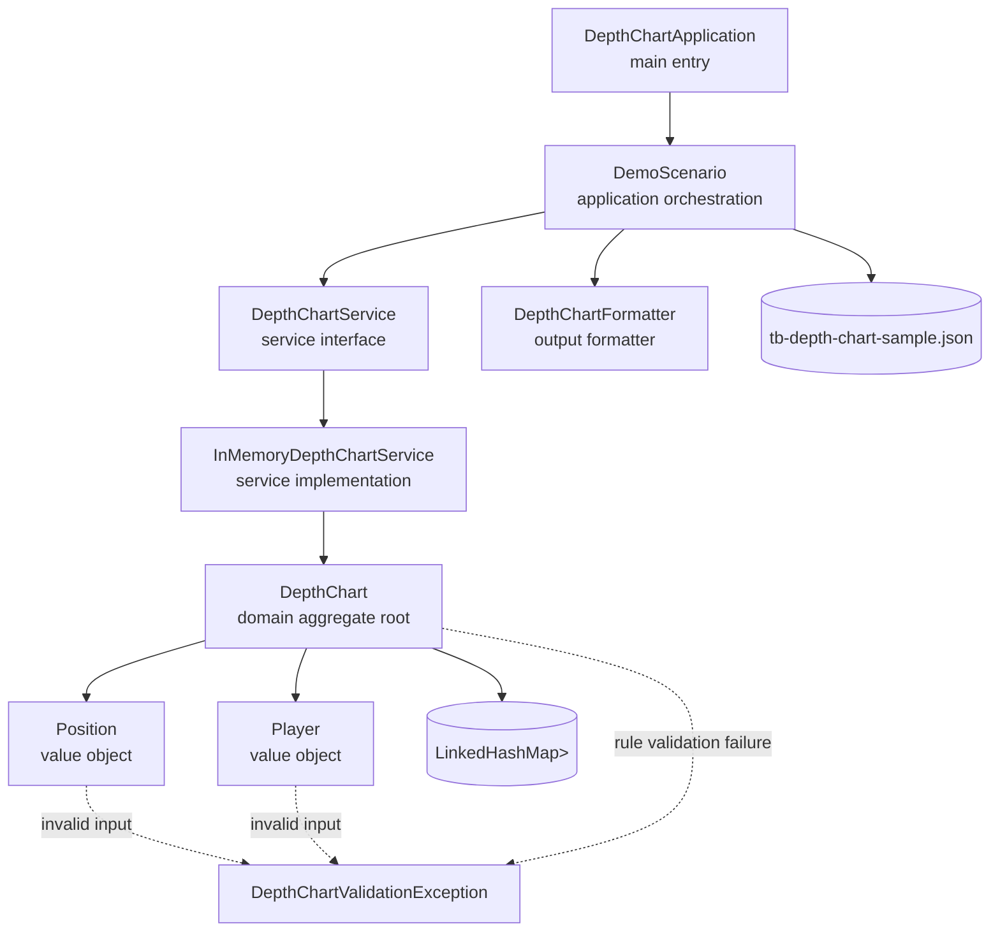
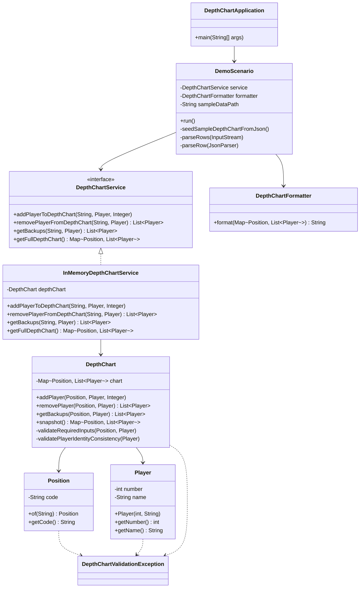
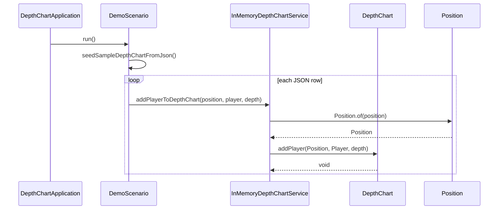
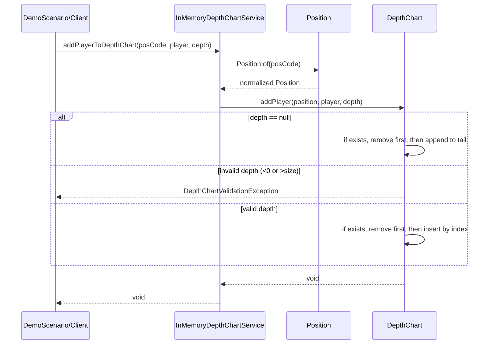
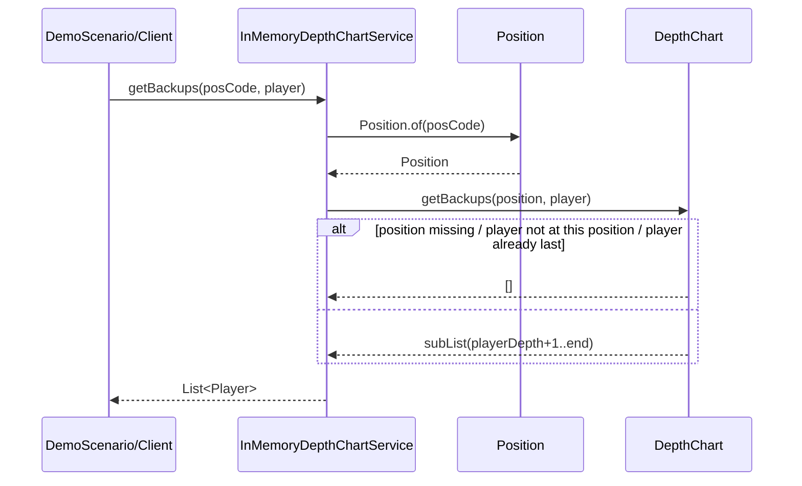
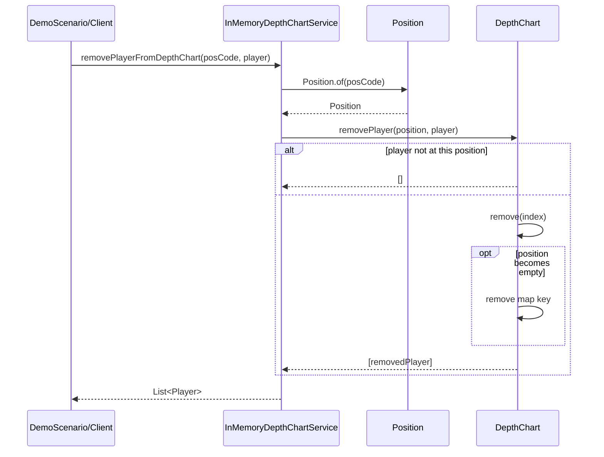
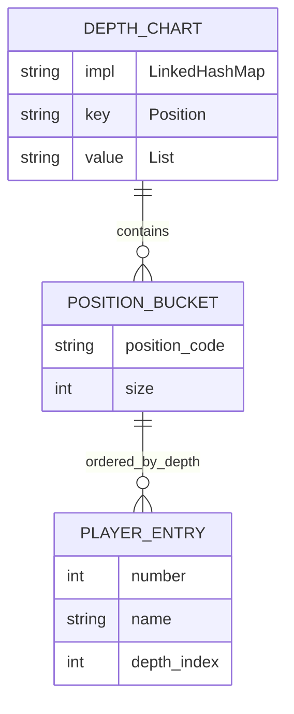

# NFL Depth Chart Manager Architecture

## 1. Layered System and Component Relationships

## 2. Core Class Diagram (Simplified)

## 3. Key Sequence Diagrams

### 3.1 Initialization and Sample Data Loading

### 3.2 Add/Reorder Player (addPlayer)

### 3.3 Query Backups (getBackups)

### 3.4 Remove Player (removePlayer)

## 4. Internal State Model

## 5. Design Notes
- The architecture follows a lightweight layered style with a domain aggregate: `DemoScenario` orchestrates flow, `Service` defines the boundary, and `DepthChart` centralizes business rules.
- Thread safety is implemented inside `DepthChart` using method-level `synchronized` locking for single-JVM consistency.
- Data is in-memory only, with no database or remote API.
- Immutable snapshot patterns are used for reads (`snapshot` + `List.copyOf` + `unmodifiableMap`) to prevent external mutation.
- Validation errors are consistently raised via `DepthChartValidationException`.

## 6. Source Mapping
- Application entry: [DepthChartApplication.java](/Users/xiaolingcui/nfl-depth-chart-manager/src/main/java/com/fanduel/depthchart/app/DepthChartApplication.java)
- Scenario orchestration: [DemoScenario.java](/Users/xiaolingcui/nfl-depth-chart-manager/src/main/java/com/fanduel/depthchart/app/DemoScenario.java)
- Service interface: [DepthChartService.java](/Users/xiaolingcui/nfl-depth-chart-manager/src/main/java/com/fanduel/depthchart/service/DepthChartService.java)
- Service implementation: [InMemoryDepthChartService.java](/Users/xiaolingcui/nfl-depth-chart-manager/src/main/java/com/fanduel/depthchart/service/InMemoryDepthChartService.java)
- Domain aggregate: [DepthChart.java](/Users/xiaolingcui/nfl-depth-chart-manager/src/main/java/com/fanduel/depthchart/domain/DepthChart.java)
- Value objects: [Player.java](/Users/xiaolingcui/nfl-depth-chart-manager/src/main/java/com/fanduel/depthchart/domain/Player.java), [Position.java](/Users/xiaolingcui/nfl-depth-chart-manager/src/main/java/com/fanduel/depthchart/domain/Position.java)
- Formatter: [DepthChartFormatter.java](/Users/xiaolingcui/nfl-depth-chart-manager/src/main/java/com/fanduel/depthchart/formatter/DepthChartFormatter.java)
- Exception: [DepthChartValidationException.java](/Users/xiaolingcui/nfl-depth-chart-manager/src/main/java/com/fanduel/depthchart/exception/DepthChartValidationException.java)
